# KultureX Admin Database ERD

## 1. ERD Scope

This ERD models the Admin Master Control System, including:

- RBAC and admin security
- CMS workflows and media
- Commerce and orders
- Events and tickets
- Moderation and policy enforcement
- Mobile app remote control
- Analytics, audit, and infrastructure logs

## 2. Detailed Table Catalog

### 2.1 Identity, RBAC, and Access

- `users`: core account record (`guest`, `registered`, `author`, `editor`, `moderator`, `admin`, `super_admin`)
- `roles`: normalized role records
- `permissions`: atomic permission records (e.g., `products.create`, `events.publish`)
- `role_permissions`: role-permission mapping
- `user_role_assignments`: user-role history and scope
- `admin_sessions`: authenticated admin sessions with refresh metadata
- `admin_devices`: known admin devices and risk state
- `user_activity_logs`: actor timeline for admin investigation

### 2.2 Content and Media CMS

- `articles`: canonical article record
- `article_versions`: immutable article revisions (Git-like versioning)
- `content_reviews`: editorial review decisions
- `categories`, `tags`, `article_categories`, `article_tags`
- `media_assets`: uploaded image/video metadata
- `media_derivatives`: transformed media variants (thumb, webp, compressed)

### 2.3 Commerce

- `brands`, `products`, `product_variants`, `inventory`
- `inventory_movements`: stock in/out ledger
- `campaigns`: drops, seasonal promotions
- `orders`, `order_items`, `payments`, `refunds`
- `vendors`: future marketplace support

### 2.4 Events and Ticketing

- `events`: event metadata and publishing status
- `ticket_types`: pricing tiers and quotas
- `tickets`: issued ticket instances
- `ticket_checkins`: QR scans and gate entries
- `event_streams`: livestream channels and states

### 2.5 Moderation and Safety

- `moderation_cases`: report/case aggregate
- `moderation_actions`: warn, remove, suspend, shadow-ban
- `toxicity_scores`: AI scoring snapshots
- `community_policies`: enforceable policy versions

### 2.6 Mobile Control Center

- `feature_flags`: per platform app feature toggles
- `app_layout_configs`: remote home/feed layout blocks
- `push_campaigns`, `push_recipients`
- `experiments`, `experiment_variants`, `experiment_assignments`

### 2.7 AI, BI, and Compliance

- `recommendation_models`, `recommendation_logs`
- `metric_snapshots`: daily pre-aggregated KPIs
- `audit_logs`: all privileged admin actions
- `api_keys`: machine/admin integration keys
- `system_incidents`: platform health and incident timeline
- `job_runs`: async job tracking
- `privacy_requests`: GDPR/data deletion workflow

## 3. ER Diagram (Mermaid)

```mermaid
erDiagram
  users {
    bigint id PK
    string username
    string email
    string password_hash
    string account_status
    datetime created_at
    datetime updated_at
  }
  roles {
    bigint id PK
    string code
    string name
    bool is_system
  }
  permissions {
    bigint id PK
    string code
    string description
  }
  role_permissions {
    bigint id PK
    bigint role_id FK
    bigint permission_id FK
  }
  user_role_assignments {
    bigint id PK
    bigint user_id FK
    bigint role_id FK
    bigint assigned_by FK
    datetime assigned_at
    datetime revoked_at
  }
  admin_sessions {
    bigint id PK
    bigint user_id FK
    string refresh_token_hash
    string ip_address
    string user_agent
    datetime last_seen_at
    datetime expires_at
  }
  admin_devices {
    bigint id PK
    bigint user_id FK
    string device_fingerprint
    string platform
    bool trusted
    datetime last_seen_at
  }
  user_activity_logs {
    bigint id PK
    bigint actor_user_id FK
    string action
    string target_type
    bigint target_id
    json metadata
    datetime created_at
  }

  articles {
    bigint id PK
    bigint author_id FK
    string title
    text summary
    text body
    string status
    datetime published_at
  }
  article_versions {
    bigint id PK
    bigint article_id FK
    int version_no
    bigint edited_by FK
    text body_snapshot
    datetime created_at
  }
  content_reviews {
    bigint id PK
    bigint article_id FK
    bigint reviewer_id FK
    string decision
    text notes
    datetime created_at
  }
  categories {
    bigint id PK
    string name
    string slug
  }
  tags {
    bigint id PK
    string name
    string slug
  }
  article_categories {
    bigint id PK
    bigint article_id FK
    bigint category_id FK
  }
  article_tags {
    bigint id PK
    bigint article_id FK
    bigint tag_id FK
  }
  media_assets {
    bigint id PK
    bigint uploaded_by FK
    string media_type
    string storage_key
    string cdn_url
    int width
    int height
    int duration_ms
    datetime created_at
  }
  media_derivatives {
    bigint id PK
    bigint media_asset_id FK
    string variant
    string cdn_url
    int bytes
  }

  brands {
    bigint id PK
    string name
    text description
    string logo_url
  }
  vendors {
    bigint id PK
    string name
    string contact_email
    string status
  }
  products {
    bigint id PK
    bigint brand_id FK
    bigint vendor_id FK
    string name
    text description
    numeric base_price
    bool is_active
  }
  product_variants {
    bigint id PK
    bigint product_id FK
    string sku
    string size
    string color
    numeric price
    bool is_active
  }
  inventory {
    bigint id PK
    bigint variant_id FK
    int stock_on_hand
    int stock_reserved
    int reorder_point
  }
  inventory_movements {
    bigint id PK
    bigint variant_id FK
    string movement_type
    int quantity_delta
    string reason
    datetime created_at
  }
  campaigns {
    bigint id PK
    string name
    string campaign_type
    datetime starts_at
    datetime ends_at
    bool is_active
  }
  orders {
    bigint id PK
    bigint user_id FK
    string status
    numeric subtotal
    numeric shipping
    numeric total
    datetime created_at
  }
  order_items {
    bigint id PK
    bigint order_id FK
    bigint variant_id FK
    int quantity
    numeric unit_price
  }
  payments {
    bigint id PK
    bigint order_id FK
    string provider
    string status
    numeric amount
    string provider_ref
    datetime created_at
  }
  refunds {
    bigint id PK
    bigint payment_id FK
    numeric amount
    string reason
    string status
    datetime created_at
  }

  events {
    bigint id PK
    bigint organizer_id FK
    string title
    text description
    string venue
    string city
    datetime start_at
    datetime end_at
    bool is_published
  }
  ticket_types {
    bigint id PK
    bigint event_id FK
    string name
    numeric price
    int quota
  }
  tickets {
    bigint id PK
    bigint event_id FK
    bigint ticket_type_id FK
    bigint user_id FK
    string qr_code
    string status
    datetime issued_at
  }
  ticket_checkins {
    bigint id PK
    bigint ticket_id FK
    bigint checked_in_by FK
    string gate
    datetime checked_in_at
  }
  event_streams {
    bigint id PK
    bigint event_id FK
    string provider
    string stream_key
    string stream_status
  }

  moderation_cases {
    bigint id PK
    bigint reported_user_id FK
    string source_type
    bigint source_id
    string status
    string severity
    datetime created_at
  }
  moderation_actions {
    bigint id PK
    bigint case_id FK
    bigint moderator_id FK
    string action_type
    text rationale
    datetime created_at
  }
  toxicity_scores {
    bigint id PK
    string source_type
    bigint source_id
    numeric score
    string model_version
    datetime created_at
  }
  community_policies {
    bigint id PK
    string policy_key
    int version
    text content
    bool active
  }

  feature_flags {
    bigint id PK
    string flag_key
    string platform
    bool enabled
    json targeting_rules
  }
  app_layout_configs {
    bigint id PK
    string platform
    string screen_key
    json layout_json
    bool active
  }
  push_campaigns {
    bigint id PK
    bigint created_by FK
    string title
    text body
    string target_segment
    datetime scheduled_at
    string status
  }
  push_recipients {
    bigint id PK
    bigint campaign_id FK
    bigint user_id FK
    string delivery_status
    datetime delivered_at
  }
  experiments {
    bigint id PK
    string exp_key
    string platform
    string status
    datetime starts_at
    datetime ends_at
  }
  experiment_variants {
    bigint id PK
    bigint experiment_id FK
    string variant_key
    int traffic_percent
    json config
  }
  experiment_assignments {
    bigint id PK
    bigint experiment_id FK
    bigint user_id FK
    bigint variant_id FK
    datetime assigned_at
  }

  recommendation_models {
    bigint id PK
    string model_key
    string model_version
    string status
    datetime deployed_at
  }
  recommendation_logs {
    bigint id PK
    bigint model_id FK
    bigint user_id FK
    string domain_type
    bigint object_id
    numeric score
    datetime created_at
  }
  metric_snapshots {
    bigint id PK
    date metric_date
    string metric_key
    numeric metric_value
    string dimension
  }
  audit_logs {
    bigint id PK
    bigint actor_user_id FK
    string action
    string object_type
    bigint object_id
    json change_set
    datetime created_at
  }
  api_keys {
    bigint id PK
    string key_name
    string key_hash
    string scope
    datetime expires_at
    bool active
  }
  system_incidents {
    bigint id PK
    string incident_key
    string severity
    string status
    text summary
    datetime opened_at
    datetime closed_at
  }
  job_runs {
    bigint id PK
    string queue_name
    string job_type
    string status
    datetime started_at
    datetime finished_at
  }
  privacy_requests {
    bigint id PK
    bigint user_id FK
    string request_type
    string status
    datetime requested_at
    datetime completed_at
  }

  users ||--o{ user_role_assignments : assigned_roles
  roles ||--o{ user_role_assignments : role_history
  roles ||--o{ role_permissions : grants
  permissions ||--o{ role_permissions : included_permissions
  users ||--o{ admin_sessions : has_sessions
  users ||--o{ admin_devices : has_devices
  users ||--o{ user_activity_logs : performs_actions

  users ||--o{ articles : writes
  articles ||--o{ article_versions : versions
  articles ||--o{ content_reviews : reviewed_by_editor
  articles ||--o{ article_categories : in_categories
  categories ||--o{ article_categories : category_links
  articles ||--o{ article_tags : tagged
  tags ||--o{ article_tags : tag_links
  media_assets ||--o{ media_derivatives : has_derivatives

  brands ||--o{ products : owns_products
  vendors ||--o{ products : supplies_products
  products ||--o{ product_variants : has_variants
  product_variants ||--|| inventory : inventory_state
  product_variants ||--o{ inventory_movements : stock_ledger
  users ||--o{ orders : places
  orders ||--o{ order_items : order_lines
  product_variants ||--o{ order_items : purchased_variant
  orders ||--o{ payments : payment_attempts
  payments ||--o{ refunds : refund_attempts

  users ||--o{ events : organizes
  events ||--o{ ticket_types : pricing_tiers
  events ||--o{ tickets : event_tickets
  ticket_types ||--o{ tickets : ticket_type_use
  tickets ||--o{ ticket_checkins : checkins
  events ||--o{ event_streams : stream_channels

  moderation_cases ||--o{ moderation_actions : actions_taken
  users ||--o{ moderation_cases : reported_cases
  users ||--o{ moderation_actions : moderator_actions

  push_campaigns ||--o{ push_recipients : deliveries
  experiments ||--o{ experiment_variants : variants
  experiments ||--o{ experiment_assignments : assignments
  experiment_variants ||--o{ experiment_assignments : selected_variant

  recommendation_models ||--o{ recommendation_logs : inference_records
  users ||--o{ recommendation_logs : personalized_targets
  users ||--o{ audit_logs : admin_actor
  users ||--o{ privacy_requests : privacy_requests
```

## 4. Data Governance Rules

- Every privileged admin mutation writes to `audit_logs`.
- Role assignment changes are immutable history (`user_role_assignments`).
- Content and moderation decisions are traceable (`content_reviews`, `moderation_actions`).
- Sensitive tokens and keys are hashed (`admin_sessions.refresh_token_hash`, `api_keys.key_hash`).
