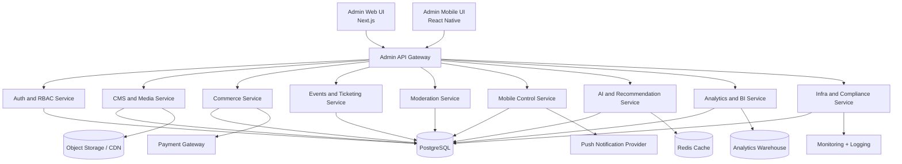

# KultureX Admin System Architecture

## 1. Master Control Vision

The Admin Portal is the single command center for both KultureX web and mobile products.

Core control domains:

- Master dashboard and operations
- RBAC user governance
- Content and media publishing
- Commerce and payments
- Events and ticketing
- Community moderation
- Mobile remote configuration
- AI recommendations and safety
- BI analytics and data exports
- DevOps, infrastructure, and compliance

## 2. Logical Architecture

## 3. Deployment Topology (Phase-Based)

### Phase A (Now): Modular Monolith

- Django REST backend with app modules (`users`, `articles`, `store`, `events`, etc.)
- Next.js admin web app
- React Native admin mobile app
- PostgreSQL + optional Redis

### Phase B (Scale): Logical Gateway + Internal Services

- Keep same DB and codebase, add internal service interfaces
- Introduce async workers for notifications, media, analytics jobs

### Phase C (High Throughput): Service Extraction

- Extract `Commerce`, `Events`, and `Moderation` into independent services
- Keep gateway contract stable to avoid frontend rewrites

## 4. Security Architecture

- JWT access/refresh tokens for admin clients
- Role-based and permission-based access checks
- Admin action audit trails
- 2FA required for `admin` and `super_admin`
- API key rotation and secrets vault integration

## 5. Cross-Platform Control Strategy

The Mobile Admin App and Web Admin share the same admin APIs and policy engine, ensuring:

- One source of truth for permissions
- Same moderation and publishing behavior
- Remote mobile feature flag control from web portal

